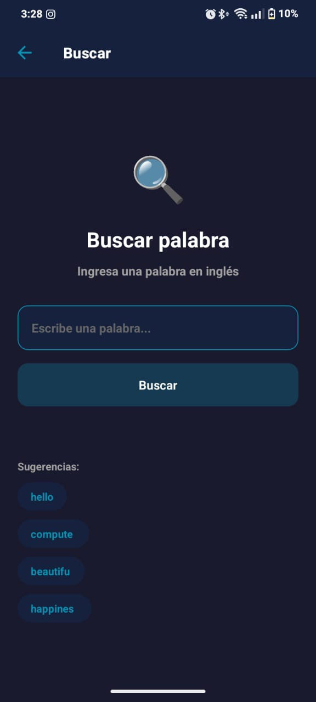
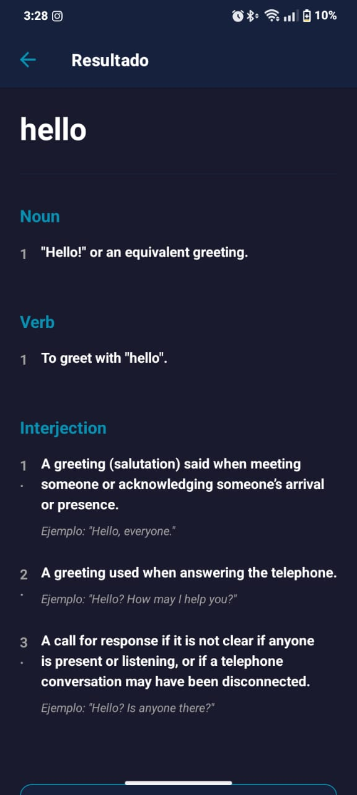

📖 Diccionario - English Dictionary App

- Nombre de la App:Diccionario (English Dictionary)
- Asignatura/Profesor:Desarrollo de Aplicaciones Móviles / M.C. Leonel González Vidales
- Periodo/Fecha:Septiembre 2025
- URL del Repositorio:https://github.com/manuelputin149-commits/diccionario-app


📋 Descripción

Diccionario es una aplicación móvil desarrollada con React Native y Expo que permite a los usuarios buscar definiciones de palabras en inglés en tiempo real. La aplicación utiliza la Free Dictionary API para proporcionar definiciones detalladas, pronunciación fonética, ejemplos de uso y sinónimos. Cuenta con una interfaz moderna con tema oscuro y navegación fluida entre pantallas.


🚀 Características

- 🔍 Búsqueda de Palabras: Campo de búsqueda intuitivo con sugerencias predefinidas
- 📖 Definiciones Detalladas: Múltiples definiciones organizadas por categoría gramatical
- 🗣️ Pronunciación Fonética: Transcripción fonética de cada palabra
- 📝 Ejemplos de Uso: Frases de ejemplo para cada definición
- 🔄 Sinónimos: Lista de palabras relacionadas
- 🎨 Interfaz Moderna: Diseño con tema oscuro (#1a1a2e, #16213e, #0891b2)
- 🧭 Navegación Stack: Sistema de navegación jerárquico con transiciones suaves
- ⚡ API en Tiempo Real: Búsquedas instantáneas sin necesidad de API key
- 📱 Diseño Responsivo: Optimizado para diferentes tamaños de pantalla


📱 Capturas de Pantalla

Pantalla de Inicio
Pantalla de bienvenida con diseño minimalista y botón de acción principal.


Pantalla de Búsqueda
Campo de texto con sugerencias de palabras populares y validación en tiempo real.



Pantalla de Resultados
Definiciones organizadas por tipo gramatical con ejemplos, pronunciación y sinónimos.




🛠️ Tecnologías y Versiones

| Dependencia | Versión | Propósito |
|------------|---------|-----------|
| `react-native` | 0.81.4 | Framework de desarrollo móvil multiplataforma |
| `react` | 19.1.0 | Biblioteca de interfaz de usuario |
| `expo` | ~54.0.25 | Framework de desarrollo móvil |
| `@react-navigation/native` | ^7.1.20 | Core de navegación entre pantallas |
| `@react-navigation/native-stack` | ^7.6.3 | Stack navigator para navegación jerárquica |
| `react-native-screens` | ~4.16.0 | Optimización de rendimiento para transiciones nativas |
| `react-native-safe-area-context` | ~5.6.2 | Manejo de áreas seguras (notch, barras de estado) |
| `expo-status-bar` | ~3.0.0 | Control de apariencia de barra de estado |
| `typescript` | ^5.3.3 | Tipado estático para JavaScript |


Verificar versiones instaladas:
```bash
npm list --depth=0
```


📋 Requisitos Previos

Antes de comenzar, asegúrate de tener instalado:

Node.js
- Versión: v18.17.0 o superior
```bash
node --version
```

NPM o Yarn
- NPM: 9.0.0+
- Yarn: 1.22.19+ (opcional)
```bash
npm --version
# o
yarn --version
```

Expo CLI
- Versión: v6.3.0+
```bash
npx expo --version
```

Dispositivo/Emulador
- Android: Android Studio v2022.3+ con Android SDK 33+ o Expo Go app
- iOS: Xcode 14+ (solo macOS) o Expo Go app
- Dispositivo físico: Expo Go instalado

Verificar entorno completo:
```bash
npx expo doctor
```


🔧 Instalación

1. Clonar el repositorio
```bash
git clone https://github.com/manuelputin149-commits/diccionario-app.git
cd diccionario-app
```

2. Instalar dependencias
```bash
npm install
```

3. Instalar dependencias de navegación
```bash
npm install @react-navigation/native @react-navigation/native-stack
npx expo install react-native-screens react-native-safe-area-context
```


🚀 Ejecución

Iniciar servidor de desarrollo
```bash
npm start
# o
npx expo start
```

Ejecutar en Android
```bash
npm run android
# o
npx expo start --android
```

Ejecutar en iOS (solo macOS)
```bash
npm run ios
# o
npx expo start --ios
```

Ejecutar en Web
```bash
npm run web
# o
npx expo start --web
```


📖 Guía de Uso

Paso 1: Pantalla de Inicio
1. Abre la aplicación
2. Visualiza la pantalla de bienvenida con el icono del libro 📖
3. Toca el botón "Comenzar búsqueda"

Paso 2: Realizar una Búsqueda
1. En la pantalla de búsqueda, ingresa una palabra en inglés en el campo de texto
2. Opción A: Escribe tu propia palabra y presiona "Buscar"
3. Opción B: Toca una de las sugerencias predefinidas:
   - hello
   - computer
   - beautiful
   - happiness

Paso 3: Ver Resultados
1. La aplicación muestra:
   - Palabra buscada en grande
   - Pronunciación fonética (ej: /həˈloʊ/)
   - Categorías gramaticales (Noun, Verb, Interjection)
   - Definiciones numeradas para cada categoría
   - Ejemplos de uso en cursiva
   - Sinónimos cuando estén disponibles
2. Toca "Nueva búsqueda" para volver

Ejemplos de Palabras para Probar
- Sustantivos: computer, happiness, freedom
- Verbos: run, create, understand
- Adjetivos: beautiful, amazing, complex


📁 Estructura del Proyecto
```
diccionario-app/
├── App.tsx                          # Componente raíz con NavigationContainer
├── app.json                         # Configuración de Expo
├── package.json                     # Dependencias y scripts
├── tsconfig.json                    # Configuración de TypeScript
├── index.ts                         # Punto de entrada
├── assets/                          # Recursos estáticos
│   ├── adaptive-icon.png
│   ├── favicon.png
│   ├── icon.png
│   └── splash-icon.png
├── screenshots/                     # Capturas de pantalla para README
│   ├── home.jpg
│   ├── search.jpg
│   └── result.jpg
└── src/
    ├── components/                  # Componentes reutilizables
    │   └── Navigation/
    │       ├── IconBack.js          # Botón de retroceso personalizado
    │       └── index.js
    ├── navigations/                 # Configuración de navegación
    │   ├── AppNavigation.js
    │   ├── HandlerNavigation.js
    │   ├── index.js
    │   ├── Styles.styles.js         # Estilos globales de navegación
    │   ├── stacks/
    │   │   └── DictionaryNavigation.tsx  # Stack de pantallas
    │   └── BottomTabNavigation/     # (Preparado para expansión)
    ├── screens/                     # Pantallas de la aplicación
    │   └── Dictionary/
    │       ├── index.ts             # Exportaciones
    │       ├── HomeScreen.tsx       # Pantalla de inicio
    │       ├── SearchScreen.tsx     # Pantalla de búsqueda
    │       └── ResultScreen.tsx     # Pantalla de resultados
    └── utils/                       # Utilidades y constantes
        ├── index.js
        └── screens.ts               # Nombres de pantallas
```


Archivos Principales:
- App.tsx: Componente raíz con NavigationContainer y providers
- DictionaryNavigation.tsx: Configuración del Stack Navigator
- HomeScreen.tsx: Pantalla de bienvenida
- SearchScreen.tsx: Entrada de búsqueda con sugerencias
- ResultScreen.tsx: Consumo de API y presentación de datos
- screens.ts: Constantes para nombres de pantallas


🌐 API Utilizada

Free Dictionary API

URL Base: `https://api.dictionaryapi.dev/api/v2/entries/en/{word}`

Ejemplo de Request:
```bash
curl https://api.dictionaryapi.dev/api/v2/entries/en/hello
```

Características:
- ✅ Completamente gratuita
- ✅ Sin necesidad de API key
- ✅ Respuestas en formato JSON
- ✅ Pronunciación fonética
- ✅ Múltiples definiciones por palabra
- ✅ Ejemplos de uso en contexto
- ✅ Sinónimos y antónimos
- ✅ Sin límite de requests

Documentación: [https://dictionaryapi.dev/](https://dictionaryapi.dev/)

Estructura de Respuesta:
```json
{
  "word": "hello",
  "phonetic": "/həˈloʊ/",
  "meanings": [
    {
      "partOfSpeech": "interjection",
      "definitions": [
        {
          "definition": "A greeting (salutation) said when meeting someone...",
          "example": "Hello, everyone.",
          "synonyms": ["hi", "hey", "greetings"]
        }
      ]
    }
  ]
}
```


🔮 Mejoras Futuras

- [ ] Historial de Búsquedas: Guardar últimas 20 palabras buscadas con AsyncStorage
- [ ] Sistema de Favoritos: Marcar palabras favoritas con persistencia local
- [ ] Modo Sin Conexión: Caché de definiciones para consulta offline
- [ ] Audio de Pronunciación: Reproducir audio con expo-av
- [ ] Compartir Definiciones: Compartir via redes sociales o mensajería
- [ ] Búsqueda Predictiva: Autocompletado mientras se escribe
- [ ] Modo Claro/Oscuro: Toggle para cambiar tema
- [ ] Traducción a Español: Integración con Google Translate API
- [ ] Búsqueda por Voz: Speech-to-text con expo-speech
- [ ] Widget de Palabra del Día: Notificaciones diarias


🐛 Solución de Problemas

| Problema | Solución |
|----------|----------|
| Error de instalación de dependencias | `npm install --legacy-peer-deps` |
| Metro bundler cache corrupto | `npx expo start --clear` |
| Puerto 8081 ocupado | `npx expo start --port 8082` |
| Dependencias desactualizadas | `npx expo doctor --fix` |
| Errores de TypeScript | `npm install --save-dev @types/react@latest` |
| La app no se conecta al servidor | `npx expo start --tunnel` |
| Errores en Android | `cd android && ./gradlew clean && cd ..` |
| Expo Go no escanea QR | Conectar a la misma red WiFi |

Comandos de Diagnóstico:
```bash

# Verificar entorno
npx expo doctor

# Limpiar caché completamente
npx expo start --clear

# Reinstalar dependencias desde cero
rm -rf node_modules package-lock.json
npm install

# Ver logs detallados
npx expo start --dev-client
```


🤝 Contribuciones

Las contribuciones son bienvenidas. Por favor:

1. Haz un fork del proyecto
2. Crea una rama para tu feature (`git checkout -b feature/NuevaCaracteristica`)
3. Commit tus cambios (`git commit -m 'Agregar nueva característica'`)
4. Push a la rama (`git push origin feature/NuevaCaracteristica`)
5. Abre un Pull Request

Guía de Estilo:
- Usar TypeScript para nuevos archivos
- Seguir convenciones de nombres existentes
- Documentar funciones complejas
- Agregar comentarios en español


📄 Licencia

Este proyecto está bajo la Licencia MIT.


📲 Instalación Directa (APK)

Última Versión: v1.0.0
Fecha de compilación: 22 de Enero 2025

Descargar APK para Android
Descarga la última versión compilada de la aplicación:

🔗 [Diccionario v1.0.0 - APK (Android)](https://expo.dev/accounts/lotso_bellaco/projects/Diccionario/builds/908b8fac-3515-491b-b9ed-88d183eba98d)

Cómo instalar:

Método 1: Desde tu celular
1. Abre el enlace anterior en tu celular Android
2. Toca el botón de descarga
3. Una vez descargado, abre el archivo APK
4. Toca "Instalar"

Método 2: Desde tu computadora
1. Descarga el APK en tu computadora
2. Transfiere el archivo a tu celular vía USB o nube
3. En tu celular, abre el archivo APK
4. Toca "Instalar"

Permisos necesarios:
- ✅ Internet (para consultar la API de diccionarios)
- ✅ Red (para verificar conectividad)

Compatibilidad:
- Android: 5.0 (API 21) o superior
- Tamaño: ~50 MB
- Arquitectura: ARM, ARM64, x86, x86_64

⚠️ Importante:
- El APK no está en Google Play Store
- Necesitarás habilitar la instalación de fuentes desconocidas
- Es completamente seguro y está firmado digitalmente
- El enlace de descarga expira en 30 días


👤 Desarrollador

Jose Manuel Fuentes Gomez
- GitHub: [@manuelputin149-commits](https://github.com/manuelputin149-commits)
- Email: manuelputin149@gmail.com

Última actualización: 10 de Enero 2025  
Versión: 1.0.0


🙏 Agradecimientos

- [Free Dictionary API](https://dictionaryapi.dev/) por proporcionar la API gratuita y sin restricciones
- [Expo](https://expo.dev/) por facilitar el desarrollo móvil multiplataforma
- [React Navigation](https://reactnavigation.org/) por el robusto sistema de navegación
- [M.C. Leonel González Vidales] por la guía y asesoría en el desarrollo
